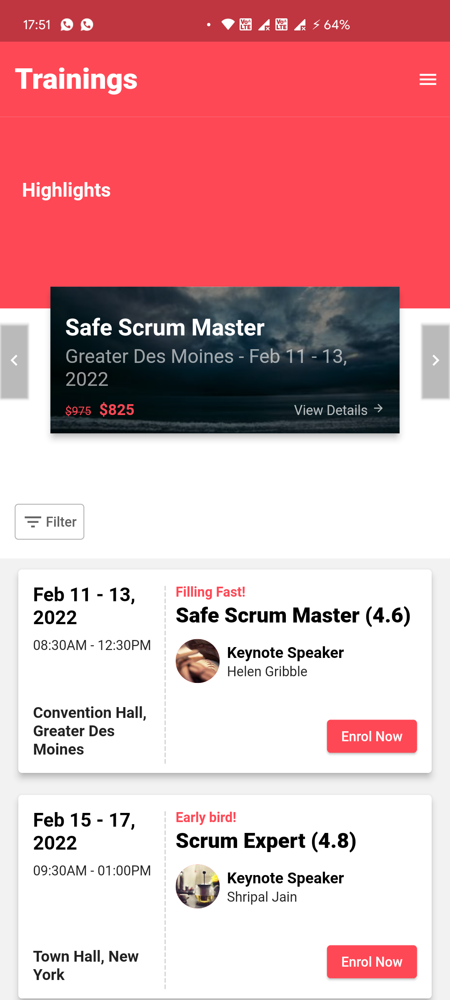

# Sample Task for ACT

Sample Task for ACT

## Target

See [Details](task_details.pdf)

## Running
You need to have Flutter SDK in your computer, with it's executable path (bin folder) added in your terminal's path
Then,
1. `flutter pub get`
2. `flutter run`

This app can be run on Android/iOS/Web

## Demo
Download APK from [here](https://github.com/shripal17/act_task/releases/tag/v1.0.0) and install it on your Android device

OR

View the web version at [Heroku](https://act-sample.herokuapp.com/) (View in portrait orientation for the suggested experience)

A Screen record can be found at [this GDrive Link](https://drive.google.com/file/d/118ZFwwds1tvQ67kw8supu1CnwIoTsOHK/view?usp=sharing)

